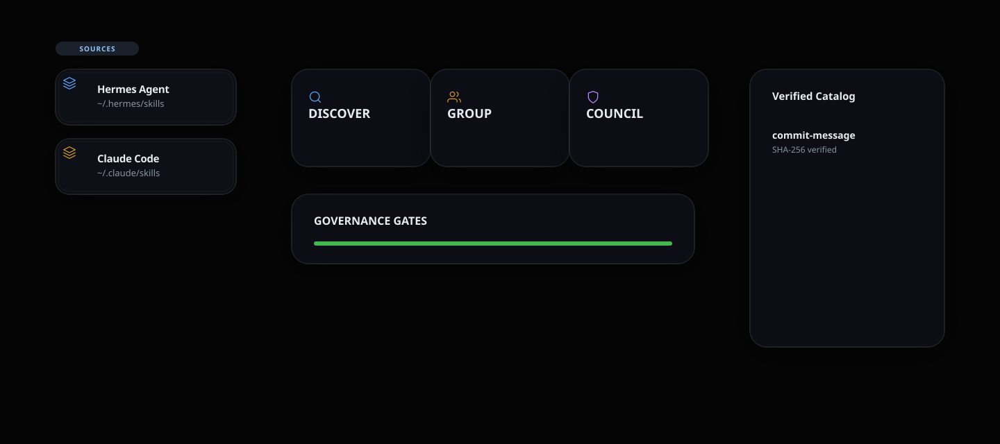
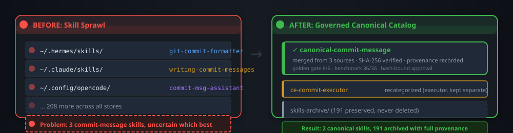
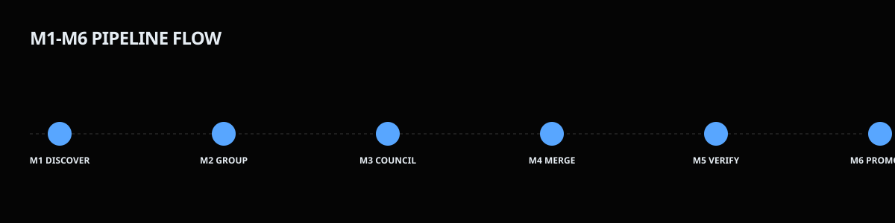
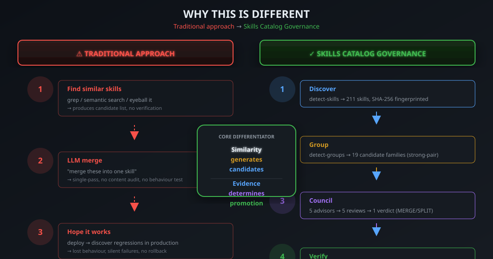
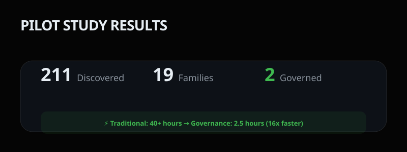
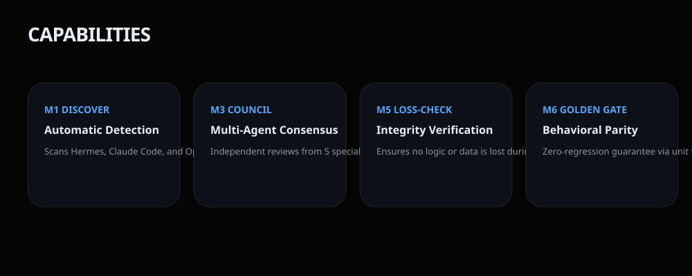

# AI-Agent Skill Governance

> Turn Skill Sprawl Into a Governed Skill Catalog

Discover, consolidate, verify and safely promote canonical skills across AI-agent harnesses.

<p align="center">
  <a href="#quickstart"></a>
  <a href="docs/lifecycle.md"></a>
  <a href="docs/security-model.md"></a>
  <a href="LICENSE"></a>
  
  
  
</p>

<p align="center">
  
</p>

<p align="center">
  <strong>Skills Catalog Governance</strong> is an agent-agnostic governance pipeline for discovering, consolidating, verifying, benchmarking, and safely promoting AI-agent skills across coding harnesses.
</p>

---

## The Problem

AI coding agents accumulate skills rapidly. Hermes profiles, Claude Code directories, OpenCode stores, Codex plugins, vendored trees — each harness maintains its own skills folder with accumulated content.

<p align="center">
  
</p>

Soon you have dozens or hundreds of skills with overlapping families: three "write a commit message" skills, five "review" skills, a family of `gstack-*` skills. Nobody can tell which is best, whether they should merge, or what they would lose by archiving one.

---

## The Solution

**Skills Catalog Governance treats skill consolidation as a gated engineering process — not a blind merge.**

<p align="center">
  
</p>

### Core Differentiator

<div align="center">
  
</div>

> **Similarity generates candidates. Evidence determines promotion.**

---

## See the Pipeline

<p align="center">
  
</p>

*Illustrative replay — based on actual pilot evidence.*

### Real Tool Output

<p align="center">
  
</p>

*Captured from an actual `check-package` execution against the repository.*

---

## Harness Compatibility & Tested Layouts

Skills Catalog Governance is **agent-agnostic**. It operates on local directories containing `SKILL.md` files and interacts through standard POSIX/Windows filesystem operations. Compatibility is based on tested filesystem layouts, not vendor APIs or official partnerships.

| Environment | Compatibility basis | Tested layout |
|---|---|---|
| **Hermes** | Tested filesystem layout | `~/.hermes/skills/`, `%APPDATA%/hermes/profiles/*/skills/` |
| **Claude Code** | Tested filesystem layout | `~/.claude/skills/` |
| **OpenCode** | Tested filesystem layout | `~/.config/opencode/skills/` |
| **Codex** | Tested filesystem layout | `~/.codex/skills/` |
| **Pi / OMP** | Tested filesystem layout | `~/.pi/agent/skills/`, `~/.omp/skills/` |
| **Other systems** | Generic filesystem compatibility | Any path supplied through `--stores <path>` |

> **Compatibility Notice:** Compatibility is based on standard `SKILL.md` filesystem conventions. This project does not claim official vendor partnerships, proprietary API integrations, or internal modifications to these harnesses.

---

## Real Pilot Evidence

211 skills were cataloged across the local stores and 19 candidate overlap families were identified. The end-to-end pilot then evaluated one commit-message family containing three related skills and resulted in two active governed skills: one consolidated generator and one executor retained separately.

<p align="center">
  
</p>

### Global Inventory & Pilot Family Results

```text
GLOBAL INVENTORY DISCOVERY
  └─ 211 skills cataloged across 5 local stores (0 parse errors)
  └─ 19 candidate overlap families identified (strong-pair TF-IDF + overlap)

COMMIT-MESSAGE FAMILY PILOT (3 related skills evaluated)
  ├─ caveman-commit           (formatter/style: terse)
  ├─ writing-commit-messages  (formatter/style: subsystem)
  └─ ce-commit                (git operator/executor)

COUNCIL & VERIFICATION OUTCOME
  ├─ Group 1 (Generator): caveman-commit + writing-commit-messages
  │   └─ Consolidated generator capability retained as the canonical caveman-commit skill
  ├─ Group 2 (Executor): ce-commit
  │   └─ Reclassified & retained separately (1 active executor)
  ├─ Golden Gate: 6 / 6 test cases matched byte-for-byte
  └─ G2 Benchmark: 36 / 36 benchmark cells PASS (format conformance & completeness)

FINAL PILOT OUTCOME
  └─ 2 active governed skills in the resulting catalog:
       1 consolidated generator + 1 git executor retained separately
```

| Lifecycle Phase | Command | Result | Evidence |
|---|---|---|---|
| **M1 Discovery** | `detect-skills` | **PASS** | 211 skills cataloged across 5 local stores; 0 parse errors (`docs/defect-report-m1-20260810.md`) |
| **M2 Grouping** | `detect-groups` | **PASS** | 19 candidate families identified (`docs/spec-m2-grouping-20260810.md`) |
| **M3 Council** | council workflow | **DECIDED** | Commit-message family: 1 generator master + 1 executor retained separately (`docs/council-verdict-commit-family-20260810.md`) |
| **M3.5 Golden Gate** | `golden-gate` | **PASS** | 6/6 output test cases matched byte-for-byte across style contracts (`docs/golden-output-experiment-20260810.md`) |
| **M5 Benchmark** | `benchmark` | **GO** | 36/36 benchmark cells PASS (`docs/benchmark.json`) |
| **M6 Promotion** | `verify-approval` + `apply-moves` | **PROMOTED** | Resulting catalog contains 2 active governed skills: 1 consolidated generator + 1 executor retained separately; absorbed source material archived non-destructively. |

> **Note on Benchmark Validation:** The `benchmark` command mechanically verifies contract invariants in the benchmark bundle, including minimum run counts, absence of LOSS cells, and the configured win-margin requirement. Semantic evaluation of generated outputs is performed by the configured LLM judge/orchestrator.

Full evidence artifacts and transcripts: [`docs/`](docs/) and [`artifacts/pilot-commit-family/`](artifacts/pilot-commit-family/).

---

## Key Capabilities

<p align="center">
  
</p>

| Capability | What It Does |
|---|---|
| **DISCOVER** | Inventory every skill across stores with SHA-256 fingerprints |
| **GROUP** | Identify candidate overlaps using TF-IDF + word overlap |
| **COUNCIL** | Make semantic consolidation decisions (mandatory, never skipped) |
| **VERIFY** | Detect content/behaviour loss — loss-check + golden-gate |
| **BENCHMARK** | Compare master against each source — must win or tie every cell |
| **PROMOTE** | Hash-bound, non-destructive promotion with full provenance |

---

## Quickstart

### 1. Requirements

- Python 3.10+ (stdlib only — **no pip dependencies**)
- macOS / Linux: `python3` on PATH
- Windows: PowerShell 5+ (or pwsh) or `python` on PATH

### 2. Install

One-liner (detects harnesses on your machine):

```bash
# macOS / Linux
curl -fsSL https://raw.githubusercontent.com/abhilash333naidu/skills-catalog-governance/main/install.sh | bash
```

```powershell
# Windows (PowerShell)
irm https://raw.githubusercontent.com/abhilash333naidu/skills-catalog-governance/main/install.ps1 | iex
```

Or specify a target directory directly:

```bash
python3 scripts/catalog_governance.py install --target <your-skills-dir>
```

Verify the install:

```bash
python3 scripts/catalog_governance.py check-package --root .
# → {"status": "PASS", ...}
```

### 3. Discover

Inventory skills across configured stores:

```bash
python3 scripts/catalog_governance.py detect-skills --output inventory.json
```

### 4. Group

Identify candidate overlap families (candidates only — no decisions):

```bash
python3 scripts/catalog_governance.py detect-groups \
    --inventory inventory.json \
    --overlap-threshold 0.50
```

### 5. Review

For each suggested group, run the council review (see [`docs/lifecycle.md`](docs/lifecycle.md) for procedure).

### 6. Verify

Build the staged master and run structural, security, and golden-gate checks:

```bash
# Check G0 (spec), G1 (security regex), G3 (versioning)
python3 scripts/catalog_governance.py check-master --draft skills-merge-drafts/master.SKILL.md

# Verify output reproduction (for formatter/generator skills)
python3 scripts/catalog_governance.py golden-gate --manifest golden.json --workdir ./work
```

### 7. Benchmark

Run benchmark bundle verification:

```bash
python3 scripts/catalog_governance.py benchmark --bundle docs/benchmark.json
```

### 8. Promote

Verify approvals and apply safe, non-destructive movement:

```bash
# Verify approval hash binding
python3 scripts/catalog_governance.py verify-approval --draft master.SKILL.md --approval approval.json

# Preflight moves to plan directory movement
python3 scripts/catalog_governance.py preflight-moves --root ./skills --archive ./skills-archive --manifest manifest.json --plan plan.json

# Apply moves safely
python3 scripts/catalog_governance.py apply-moves --plan plan.json --apply --yes
```

---

## How It Works (Pipeline)

The lifecycle is divided into six phases (M1–M6), each producing a deterministic artifact:

| Phase | Command | Output |
|---|---|---|
| **M1 — Discovery** | `detect-skills` | Tagged inventory with names, descriptions, SHA-256 |
| **M2 — Grouping** | `detect-groups` | Similar-pair candidates + suggested groups |
| **M3 — Council** | (human-supervised LLM review) | Verdict: merge / split / recategorize |
| **M3.5 — Golden Gate** | `golden-gate` | N/N output match = absorption authorized |
| **M4 — Master Build** | `check-master` | G0/G1/G3-gated staged draft |
| **M5 — Benchmark** | `benchmark` | GO/NO-GO verdict |
| **M6 — Promotion** | `preflight-moves` + `apply-moves` | SHA-256-verified live install & safe archiving |

Detailed lifecycle documentation: [`docs/lifecycle.md`](docs/lifecycle.md).

---

## Governance-Driven Safety & Integrity

Skills Catalog Governance includes security and integrity controls embedded in its governance pipeline. These protect against accidental data loss, tampering, and unsafe operations during skill consolidation.

> The project includes security and integrity controls, but it is not currently a comprehensive security scanner for malicious or poisoned skills. The G1 static scan is a first-pass regex check — it catches obvious credential exposures and code-execution patterns but is not a semantic security analyser.

### Implemented Controls vs. Known Scope

| Implemented Integrity Controls | Known Limitations & Boundaries |
|---|---|
| **SHA-256 tree integrity** — verified before, during, and after movement | **No comprehensive malicious-skill scanner** — regex pattern checks only |
| **Hash-bound approval** — approvals cryptographically bound to draft content | **No semantic prompt-injection analysis** — XML tag checks in description only |
| **Drift detection** — source changes post-review block execution | **No comprehensive dependency analysis** — simple unpinned range check |
| **Non-destructive archival** — moves to `skills-archive/`, never deletes | **No runtime agent monitoring** — operates as an offline pipeline |
| **Hardened runner execution** — golden runners disabled by default, shell metachars refused | **No cross-skill interaction analysis** — no dynamic collision detection |
| **Fail-closed promotion gates** | **No cryptographic signing infrastructure** — file hashes only |

See [`docs/security-model.md`](docs/security-model.md) for full scope.

---

## Architecture & Documentation Map

`scripts/catalog_governance.py` is a single-file Python CLI (stdlib-only, 2059 lines). It operates on local skill directories and produces structured JSON output.

| Document | Content |
|---|---|
| [`docs/architecture.md`](docs/architecture.md) | Code structure, CLI commands, design principles |
| [`docs/lifecycle.md`](docs/lifecycle.md) | M1–M6 pipeline: purpose, commands, output of each phase |
| [`docs/governance-model.md`](docs/governance-model.md) | Gates, non-negotiables, state transitions |
| [`docs/benchmarking.md`](docs/benchmarking.md) | G2 benchmark conditions, bundle schema, judge honesty |
| [`docs/security-model.md`](docs/security-model.md) | Governance-driven safety, implemented controls, gaps |
| [`docs/golden-gate.md`](docs/golden-gate.md) | Output reproduction verification |
| [`docs/provenance.md`](docs/provenance.md) | Source tracking, version discipline, package integrity |

---

## Future Direction

Acknowledged future capabilities (not current features):

- Runtime integration with self-learning agents — monitoring skill drift during operation
- Agent-generated skill proposals — accepting skills produced by agent self-learning
- Skill freshness and drift detection — flagging stale or behaviourally drifted skills
- Stronger semantic security analysis — extending G1 beyond regex to AST-level scanning
- External-source trust and signing — verifying skill provenance from third-party publishers
- Dependency and vulnerability intelligence — CVE scanning, lockfile verification
- Cross-skill interaction analysis — detecting conflicts, race conditions, ordering constraints

---

## Platform Support

Windows, Linux, macOS. Junction-aware on Windows, symlink-aware on POSIX. Tested on Windows 10 / git-bash with Python 3.11+.

## License

MIT — see [`LICENSE`](LICENSE).

## Evidence

The commit-message family pilot (2026-08-10) ran the full pipeline end-to-end: 211 skills cataloged, 19 candidate families identified, council verdict (two active skills retained), golden-output 6/6 match, G2 benchmark 36/36 cells PASS. Full transcripts and benchmark data in [`docs/`](docs/) and [`artifacts/pilot-commit-family/`](artifacts/pilot-commit-family/).
