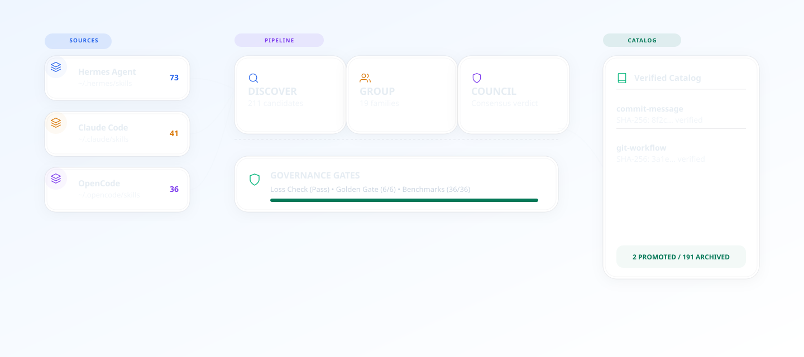
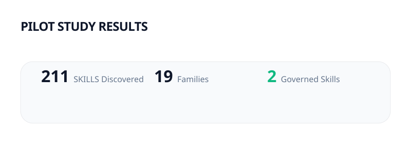
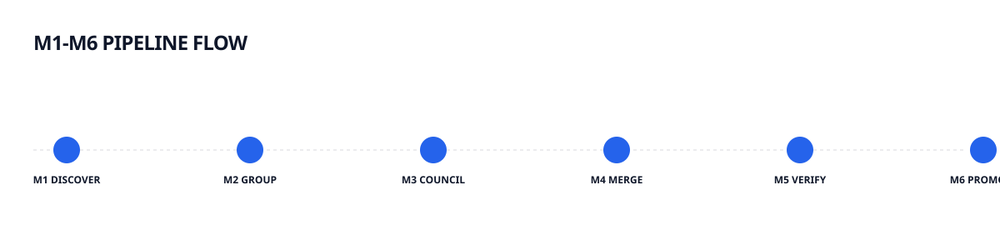
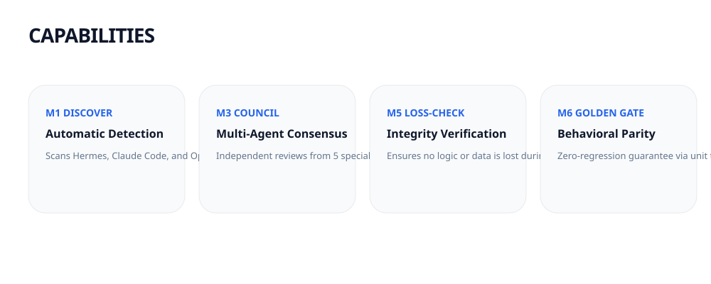
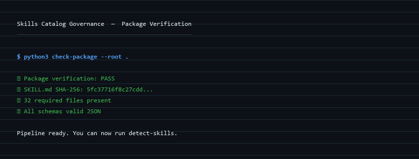

<div align="center">

# 🛡️ Skills Catalog Governance

**Turn skill sprawl into a SHA-256 verified canonical catalog**

Gated governance pipeline for AI-agent skills — discover, consolidate, verify, benchmark, and safely promote.

[](https://github.com/abhilash333naidu/skills-catalog-governance/actions/workflows/ci.yml)
[](https://www.python.org/downloads/)
[](LICENSE)
[](https://astral.sh/ruff/)
[]()
[]()

</div>

<div align="center">
  <picture>
    <source media="(prefers-color-scheme: dark)" srcset="assets/brand/hero.svg">
    
  </picture>
</div>

---

## What It Is

AI coding agents accumulate skills at a frightening pace. Hermes profiles, Claude Code directories, OpenCode stores, Codex plugins — each harness maintains its own `skills/` folder. Left ungoverned, that growth produces **overlapping, contradictory, and unverifiable skill families**.

**Skills Catalog Governance** treats skill consolidation as a **gated engineering process** — not a blind merge. Every decision, verification, and promotion is auditable.

## Why It's Different

<div align="center">
  <picture>
    <source media="(prefers-color-scheme: dark)" srcset="assets/diagrams/why-different.svg">
    
  </picture>
</div>

> **Similarity generates candidates. Evidence determines promotion.**

Traditional mergers collapse duplicates blindly. This pipeline gates every consolidation with loss-checks, output reproduction, benchmarks, and hash-bound approvals.

## Pilot Evidence — Real Run Results

**2026-08-10 end-to-end run:**

<div align="center">
  <picture>
    <source media="(prefers-color-scheme: dark)" srcset="assets/evidence/pilot-result.svg">
    
  </picture>
</div>

```text
GLOBAL INVENTORY
  └─ 211 skills across 5 local stores (0 parse errors)
  └─ 19 candidate overlap families identified

COMMIT-MESSAGE FAMILY (3 related skills evaluated)
  ├─ caveman-commit (formatter/terse)
  ├─ writing-commit-messages (formatter/subsystem)
  └─ ce-commit (git executor)

VERIFICATION OUTCOME
  ├─ Golden Gate: 6/6 byte-for-byte match
  ├─ G2 Benchmark: 36/36 cells PASS
  └─ Final: 2 active governed skills promoted
```

| Phase | Command | Result |
|---|---|---|
| M1 Discovery | `detect-skills` | **PASS** — 211 skills, 0 parse errors |
| M2 Grouping | `detect-groups` | **PASS** — 19 candidate families |
| M3 Council | council workflow | **DECIDED** — 1 generator + 1 executor |
| M3.5 Golden Gate | `golden-gate` | **PASS** — 6/6 match |
| M5 Benchmark | `benchmark` | **GO** — 36/36 cells PASS |
| M6 Promotion | `verify-approval` + `apply-moves` | **PROMOTED** — 2 skills |

<details>
<summary><b>📊 Full pilot transcript</b></summary>

```text
COUNCIL & VERIFICATION OUTCOME
  ├─ Group 1 (Generator): caveman-commit + writing-commit-messages
  │   └─ Consolidated generator retained canonically
  ├─ Group 2 (Executor): ce-commit
  │   └─ Reclassified & retained separately (1 active executor)
  ├─ Golden Gate: 6 / 6 test cases matched byte-for-byte
  └─ G2 Benchmark: 36 / 36 benchmark cells PASS

FINAL PILOT OUTCOME
  └─ 2 active governed skills:
       1 consolidated generator + 1 git executor retained separately
```

Full transcripts: [`docs/`](docs/) · [`artifacts/pilot-commit-family/`](artifacts/pilot-commit-family/)
</details>

---

## How It Works

**Six gated phases (M1–M6)** — each produces a deterministic artifact:

<div align="center">
  <picture>
    <source media="(prefers-color-scheme: dark)" srcset="assets/diagrams/pipeline.svg">
    
  </picture>
</div>

| Phase | What It Does | Gate |
|---|---|---|
| **M1 · Discover** | Inventory every skill with SHA-256 fingerprints | Parse integrity |
| **M2 · Group** | Identify overlap candidates (TF-IDF + word overlap) | Similarity threshold |
| **M3 · Council** | Make semantic consolidation decisions | Mandatory review |
| **M3.5 · Golden Gate** | Verify output reproduction for formatters/generators | Byte-for-byte match |
| **M4 · Master Build** | Validate staged draft (spec, security, versioning) | G0/G1/G3 gates |
| **M5 · Benchmark** | Compare master against sources — must win/tie every cell | GO/NO-GO |
| **M6 · Promote** | Hash-bound non-destructive promotion | Approval verification |

<div align="center">
  <picture>
    <source media="(prefers-color-scheme: dark)" srcset="assets/diagrams/capabilities.svg">
    
  </picture>
</div>

---

## Quick Start

### Requirements

- **Python 3.10+** (stdlib only — **no pip dependencies**)
- macOS / Linux: `python3` · Windows: `python` or PowerShell 5+

### Install

**One-liner** (auto-detects harnesses):

```bash
# macOS / Linux
curl -fsSL https://raw.githubusercontent.com/abhilash333naidu/skills-catalog-governance/main/install.sh | bash
```

```powershell
# Windows
irm https://raw.githubusercontent.com/abhilash333naidu/skills-catalog-governance/main/install.ps1 | iex
```

**Or target a specific directory:**

```bash
python3 scripts/catalog_governance.py install --target <your-skills-dir>
```

### Verify

```bash
python3 scripts/catalog_governance.py check-package --root .
# → {"status": "PASS", "skill_sha256": "5fc37716…", ...}
```

<div align="center">
  <picture>
    <source media="(prefers-color-scheme: dark)" srcset="assets/demo/check-package-output.png">
    
  </picture>
</div>

<details>
<summary><b>▶ Real check-package output</b></summary>

```json
{
  "invalid_files": [],
  "message": "all required package files are present and valid",
  "missing_files": [],
  "required_files": [
    "references/…",
    "schemas/approval.schema.json",
    "schemas/benchmark.schema.json",
    "schemas/council-verdict.schema.json",
    "schemas/golden.schema.json",
    "schemas/loss-check.schema.json",
    "schemas/manifest.schema.json",
    "schemas/provenance.schema.json",
    "scripts/catalog_governance.py"
  ],
  "skill_sha256": "5fc37716…",
  "status": "PASS"
}
```
</details>

### Run the Pipeline

<details>
<summary><b>▶ M1–M6 commands</b> (copy-paste ready)</summary>

```bash
# M1 · Discover
python3 scripts/catalog_governance.py detect-skills --output inventory.json

# M2 · Group
python3 scripts/catalog_governance.py detect-groups \
    --inventory inventory.json \
    --overlap-threshold 0.50

# M3 · Council → see docs/lifecycle.md for review procedure

# M3.5 · Golden Gate
python3 scripts/catalog_governance.py golden-gate --manifest golden.json --workdir ./work

# M4 · Master Build
python3 scripts/catalog_governance.py check-master --draft master.SKILL.md

# M5 · Benchmark
python3 scripts/catalog_governance.py benchmark --bundle docs/benchmark.json

# M6 · Promotion
python3 scripts/catalog_governance.py verify-approval --draft master.SKILL.md --approval approval.json
python3 scripts/catalog_governance.py preflight-moves --root ./skills --archive ./skills-archive --manifest manifest.json --plan plan.json
python3 scripts/catalog_governance.py apply-moves --plan plan.json --apply --yes
```
</details>

<details>
<summary><b>🔧 Full CLI reference</b></summary>

| Subcommand | Purpose |
|---|---|
| `detect-skills` | Inventory skills with SHA-256 fingerprints |
| `detect-groups` | Find overlap families (TF-IDF + word overlap) |
| `golden-gate` | Verify output reproduction |
| `check-master` | Gate staged draft (G0/G1/G3) |
| `benchmark` | G2 benchmark verification (GO/NO-GO) |
| `verify-approval` | Hash-bound approval check |
| `preflight-moves` | Non-destructive move planning |
| `apply-moves` | Execute promotion with lock + drift protection |
| `repair` | Deterministic 3-round loss-check re-verification |
| `validate-manifest` / `validate-council-verdict` | Schema validation |
| `loss-check` | Content/behaviour loss detection |
| `check-package` | Package integrity verification |

Run `python3 scripts/catalog_governance.py --help` for full details.
</details>

---

## Architecture

**Stdlib-only Python 3.10+.** One file, zero runtime dependencies.

| Component | Detail |
|---|---|
| Language | Python 3.10+ (stdlib-only — no pip runtime deps) |
| CLI | Single-file `scripts/catalog_governance.py` |
| Determinism | Structured JSON output, hash-bound, replayable |
| Platforms | Windows (junction-aware), macOS & Linux (symlink-aware) |
| Safety | SHA-256 integrity, loss-check, golden-gate, G0–G3 gates |
| Footprint | No external services, no SaaS, no network at runtime |

Full architecture: [`docs/architecture.md`](docs/architecture.md) · Full lifecycle: [`docs/lifecycle.md`](docs/lifecycle.md)

---

## Safety Model

Skills Catalog Governance embeds integrity controls through the whole pipeline.

**Critically:** this is a **governance pipeline**, not a malicious-skill scanner. Read [`docs/security-model.md`](docs/security-model.md) for the honest boundary.

| Implemented Controls | Known Limitations |
|---|---|
| SHA-256 tree integrity (before/during/after) | No comprehensive malicious-skill scanner (regex only) |
| Hash-bound approvals (crypto-bound to draft) | No semantic prompt-injection analysis |
| Drift detection (post-review changes block) | No comprehensive dependency/CVE analysis |
| Non-destructive archival (moves, never deletes) | No runtime agent monitoring (offline pipeline) |
| Hardened runner exec (disabled by default) | No cross-skill interaction analysis |
| Fail-closed promotion gates | No cryptographic signing infra (file hashes only) |

**Vulnerability reporting:** [`SECURITY.md`](SECURITY.md)

---

## Documentation

| Document | Content |
|---|---|
| [`docs/architecture.md`](docs/architecture.md) | Code structure, CLI commands, design principles |
| [`docs/lifecycle.md`](docs/lifecycle.md) | M1–M6 pipeline: purpose, commands, outputs |
| [`docs/governance-model.md`](docs/governance-model.md) | Gates, non-negotiables, state transitions |
| [`docs/benchmarking.md`](docs/benchmarking.md) | G2 benchmark conditions, bundle schema |
| [`docs/security-model.md`](docs/security-model.md) | Governance-driven safety, controls, gaps |
| [`docs/golden-gate.md`](docs/golden-gate.md) | Output reproduction verification |
| [`docs/provenance.md`](docs/provenance.md) | Source tracking, version discipline |

---

## Contributing

See [`CONTRIBUTING.md`](CONTRIBUTING.md) for the contribution guide and [`CODE_OF_CONDUCT.md`](CODE_OF_CONDUCT.md) for community standards.

```bash
python -m pip install -r requirements-dev.txt   # pytest, ruff
python -m pytest tests/ --cov=scripts --cov-report=term
ruff check scripts/ tests/
python scripts/catalog_governance.py check-package --root .
```

---

## Project Structure

```
skills-catalog-governance/
├── assets/
│   ├── brand/              # Hero graphics, logos
│   ├── demo/               # Screenshots, real outputs
│   └── diagrams/           # Architecture & capability diagrams
├── docs/
│   ├── architecture.md      # Technical design & CLI reference
│   ├── benchmarking.md      # G2 benchmark methodology
│   ├── governance-model.md  # Gates, non-negotiables
│   ├── golden-gate.md       # Output reproduction verification
│   ├── lifecycle.md         # M1–M6 pipeline deep-dive
│   ├── provenance.md        # Source tracking & integrity
│   └── security-model.md    # Safety controls & boundaries
├── schemas/                 # JSON schemas for all artifacts
├── scripts/
│   └── catalog_governance.py    # Main governance pipeline
├── references/              # Research, methodology notes
├── artifacts/               # Generated pipeline outputs
├── install.ps1 / install.sh # One-liner installers
├── LICENSE
├── README.md
├── SECURITY.md
├── SKILL.md
├── CODE_OF_CONDUCT.md
└── CONTRIBUTING.md
```

---

## Future Direction

Acknowledges (not current features): runtime integration & skill-drift monitoring · agent-generated skill proposals · freshness/drift detection · AST-level G1 security scan · external-source trust & signing · dependency/CVE intelligence · cross-skill interaction analysis.

---

## License

**MIT** — see [`LICENSE`](LICENSE).
