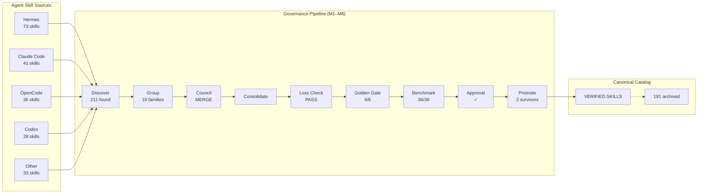
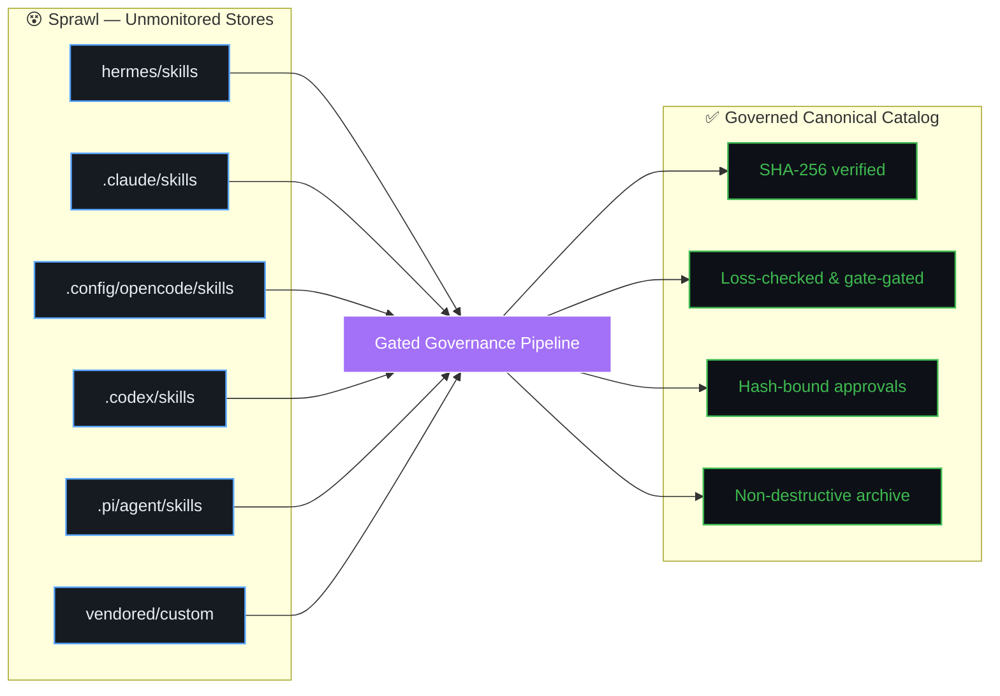
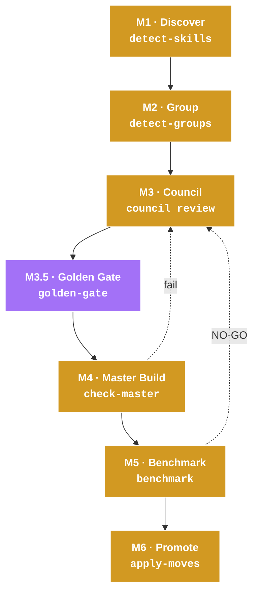

<div align="center">

# 🛡️ AI-Agent Skill Governance

### Turn Skill Sprawl Into a Governed Skill Catalog

Discover, consolidate, verify, and safely promote canonical skills across AI-agent harnesses.

<!-- ============================= BADGES ============================= -->

[](https://github.com/abhilash333naidu/skills-catalog-governance/actions/workflows/ci.yml)
[](CONTRIBUTING.md)
[](https://www.python.org/downloads/)
[](LICENSE)
[](https://astral.sh/ruff/)
[]()
[]()

</div>

<div align="center">
  <picture>
    <source media="(prefers-color-scheme: dark)" srcset="assets/brand/hero.svg">
    
  </picture>
</div>

<!-- Architecture pipeline fallback (Mermaid) -->


**Skills Catalog Governance** is an **agent-agnostic governance pipeline** for discovering, consolidating, verifying, benchmarking, and safely promoting AI-agent skills across coding harnesses — package-integrity checked, hash-bound, and non-destructive.

---

## 📖 Overview

AI coding agents accumulate skills at a frightening pace. Hermes profiles, Claude Code directories, OpenCode stores, Codex plugins, vendored trees — each harness maintains its own `skills/` folder with its own accumulated content. Left ungoverned, that growth produces overlapping, contradictory, and unverifiable skill families.

**Skills Catalog Governance** treats skill consolidation as a **gated engineering process** — not a blind merge. Where a naive merge collapses risks silently, this pipeline makes every decision, every verification, and every promotion auditable.

### Sprawl vs. Governed



### Why Different — a Pipeline, Not a Merger

> **Similarity generates candidates. Evidence determines promotion.**

A governance chain gates every consolidation decision, so nothing ships blind.

<div align="center">
  <picture>
    <source media="(prefers-color-scheme: dark)" srcset="assets/diagrams/why-different.svg">
    
  </picture>
</div>

---

## 🏗️ Tech Stack & Architecture

**Stdlib-only Python 3.10+.** One file, zero runtime dependencies. Runs anywhere Python runs.

| Component | Detail |
|---|---|
| Language | Python 3.10+ (stdlib-only — no pip runtime deps) |
| CLI | Single-file `scripts/catalog_governance.py` |
| Determinism | Structured JSON output, hash-bound &amp; replayable |
| Platforms | Windows (junction-aware), macOS &amp; Linux (symlink-aware) |
| Safety | SHA-256 tree integrity, loss-check, golden-gate, G0–G3 gates |
| Footprint | No external services, no SaaS, no network at runtime |

The complete lifecycle splits into six phases (**M1–M6**), each producing a **deterministic artifact** consumed by the next phase:



> Full architecture &amp; design notes: [`docs/architecture.md`](docs/architecture.md). Full lifecycle: [`docs/lifecycle.md`](docs/lifecycle.md).

---

## 🚀 Quick Start Guide

### Requirements

- **Python 3.10+** (stdlib only — **no pip dependencies**)
- macOS / Linux: `python3` on PATH · Windows: `python` (or PowerShell 5+/pwsh)

### 1 · Install

One-liner (detects harnesses on your machine):

```bash
# macOS / Linux
curl -fsSL https://raw.githubusercontent.com/abhilash333naidu/skills-catalog-governance/main/install.sh | bash
```

```powershell
# Windows (PowerShell)
irm https://raw.githubusercontent.com/abhilash333naidu/skills-catalog-governance/main/install.ps1 | iex
```

…or point directly at a target directory:

```bash
python3 scripts/catalog_governance.py install --target <your-skills-dir>
```

Verify the install:

```bash
python3 scripts/catalog_governance.py check-package --root .
# → {"status": "PASS", ...}
```

<details>
<summary><b>▶ Real <code>check-package</code> output</b> (captured from an actual run)</summary>

<pre>
{
  "invalid_files": [],
  "message": "all required package files are present and valid",
  "missing_files": [],
  "required_files": [
    "references/…",
    "schemas/approval.schema.json",
    "schemas/benchmark.schema.json",
    "schemas/council-verdict.schema.json",
    "schemas/golden.schema.json",
    "schemas/loss-check.schema.json",
    "schemas/manifest.schema.json",
    "schemas/provenance.schema.json",
    "scripts/catalog_governance.py"
  ],
  "skill_sha256": "5fc37716…",
  "status": "PASS"
}
</pre>
</details>

<div align="center">
  <picture>
    <source media="(prefers-color-scheme: dark)" srcset="assets/demo/check-package-output.png">
    
  </picture>
</div>

### Run the pipeline

<details>
<summary><b>▶ M1–M6 pipeline commands</b> (copy-paste ready)</summary>

```bash
# M1 · Discover
python3 scripts/catalog_governance.py detect-skills --output inventory.json

# M2 · Group
python3 scripts/catalog_governance.py detect-groups \
    --inventory inventory.json \
    --overlap-threshold 0.50

# M3 · Council  →  docs/lifecycle.md for the review procedure

# M3.5 · Golden Gate (output reproduction)
python3 scripts/catalog_governance.py golden-gate --manifest golden.json --workdir ./work

# M4 · Master Build (G0/G1/G3 gates)
python3 scripts/catalog_governance.py check-master --draft skills-merge-drafts/master.SKILL.md

# M5 · Benchmark
python3 scripts/catalog_governance.py benchmark --bundle docs/benchmark.json

# M6 · Promotion
python3 scripts/catalog_governance.py verify-approval --draft master.SKILL.md --approval approval.json
python3 scripts/catalog_governance.py preflight-moves --root ./skills --archive ./skills-archive --manifest manifest.json --plan plan.json
python3 scripts/catalog_governance.py apply-moves --plan plan.json --apply --yes
```
</details>

<details>
<summary><b>🔧 Full CLI surface</b> (every subcommand)</summary>

| Subcommand | Purpose |
|---|---|
| `detect-skills` | Inventory every skill across stores (SHA-256 fingerprints) |
| `detect-groups` | Candidate overlap families (TF-IDF + word overlap) |
| `golden-gate` | Verify output reproduction for formatter/generator skills |
| `check-master` | Gate staged draft (G0 spec, G1 security, G3 versioning) |
| `benchmark` | G2 benchmark bundle verification (GO/NO-GO) |
| `verify-approval` | Hash-bound approval check |
| `preflight-moves` | Plan directory movement non-destructively |
| `apply-moves` | Apply moves with lock + drift protection |
| `repair` | Deterministic 3-round re-verification of loss-check failures |
| `validate-manifest` / `validate-council-verdict` | Schema validation |
| `loss-check` | Content/behaviour loss detection |
| `check-package` | Verify package integrity (`--root`) |

Run `python3 scripts/catalog_governance.py --help` for full argument flags.
</details>

---

## 🧪 Pilot Evidence

A real end-to-end run (2026-08-10) cataloged **211 skills** across the local stores, surfaced **19 candidate overlap families**, then evaluated one commit-message family containing **3 related skills** and produced **2 active governed skills**.

<div align="center">
  <picture>
    <source media="(prefers-color-scheme: dark)" srcset="assets/evidence/pilot-result.svg">
    
  </picture>
</div>

<details>
<summary><b>📊 Global inventory &amp; pilot family — full run log</b></summary>

```text
GLOBAL INVENTORY DISCOVERY
  └─ 211 skills cataloged across 5 local stores (0 parse errors)
  └─ 19 candidate overlap families identified (strong-pair TF-IDF + overlap)

COMMIT-MESSAGE FAMILY PILOT (3 related skills evaluated)
  ├─ caveman-commit           (formatter/style: terse)
  ├─ writing-commit-messages  (formatter/style: subsystem)
  └─ ce-commit                (git operator/executor)

COUNCIL & VERIFICATION OUTCOME
  ├─ Group 1 (Generator): caveman-commit + writing-commit-messages
  │   └─ Consolidated generator retained canonically
  ├─ Group 2 (Executor): ce-commit
  │   └─ Reclassified & retained separately (1 active executor)
  ├─ Golden Gate: 6 / 6 test cases matched byte-for-byte
  └─ G2 Benchmark: 36 / 36 benchmark cells PASS

FINAL PILOT OUTCOME
  └─ 2 active governed skills:
       1 consolidated generator + 1 git executor retained separately
```
</details>

| Lifecycle Phase | Command | Result |
|---|---|---|
| M1 Discovery | `detect-skills` | **PASS** — 211 skills, 0 parse errors |
| M2 Grouping | `detect-groups` | **PASS** — 19 candidate families |
| M3 Council | council workflow | **DECIDED** — 1 generator master + 1 executor retained |
| M3.5 Golden Gate | `golden-gate` | **PASS** — 6/6 byte-for-byte match |
| M5 Benchmark | `benchmark` | **GO** — 36/36 cells PASS |
| M6 Promotion | `verify-approval` + `apply-moves` | **PROMOTED** — 2 active governed skills |

> **Benchmark honesty note:** `benchmark` mechanically verifies contract invariants (run counts, absence of LOSS cells, win-margin). Semantic evaluation of generated outputs is performed by the configured LLM judge/orchestrator — see [`docs/benchmarking.md`](docs/benchmarking.md).

Full evidence &amp; transcripts: [`docs/`](docs/) and [`artifacts/pilot-commit-family/`](artifacts/pilot-commit-family/).

---

## 🔧 Key Capabilities

<div align="center">
  <picture>
    <source media="(prefers-color-scheme: dark)" srcset="assets/diagrams/capabilities.svg">
    
  </picture>
</div>

| Capability | What it does |
|---|---|
| **Discover** | Inventory every skill across stores with SHA-256 fingerprints |
| **Group** | Identify candidate overlaps (TF-IDF + word overlap) |
| **Council** | Make semantic consolidation decisions (mandatory, never skipped) |
| **Verify** | Detect content/behaviour loss — loss-check + golden-gate |
| **Benchmark** | Compare master against each source — must win or tie every cell |
| **Promote** | Hash-bound, non-destructive promotion with full provenance |

---

## 📁 Project Structure

```
skills-catalog-governance/
├── assets/
│   ├── brand/              # Hero graphics, logos
│   ├── demo/               # Screenshots, demo outputs
│   └── diagrams/           # Architecture & capability diagrams
├── docs/
│   ├── architecture.md      # Technical design & CLI reference
│   ├── benchmarking.md      # G2 benchmark methodology
│   ├── governance-model.md  # Gates, non-negotiables, transitions
│   ├── golden-gate.md       # Output reproduction verification
│   ├── lifecycle.md         # M1–M6 pipeline deep-dive
│   ├── provenance.md        # Source tracking & integrity
│   └── security-model.md    # Safety controls & boundaries
├── E2E_TEST_RUN/
│   ├── acceptance_runner.py # End-to-end test orchestrator
│   └── [fixtures]/          # Test data, golden outputs
├── schemas/
│   ├── approval.schema.json
│   ├── benchmark.schema.json
│   ├── council-verdict.schema.json
│   ├── golden.schema.json
│   ├── loss-check.schema.json
│   ├── manifest.schema.json
│   └── provenance.schema.json
├── scripts/
│   ├── catalog_governance.py    # Main governance pipeline
│   ├── capture_output.py        # Visual evidence generator
│   └── generate_demo_gif.py     # Demo animation generator
├── references/              # Research, methodology notes
├── artifacts/              # Generated pipeline outputs
├── .github/
│   └── workflows/
│       ├── ci.yml           # CI pipeline
│       └── lint-svg.yml     # SVG linting
├── install.ps1             # Windows one-liner installer
├── install.sh              # Unix one-liner installer
├── LICENSE
├── README.md
├── SECURITY.md
├── SKILL.md
├── CODE_OF_CONDUCT.md
├── CONTRIBUTING.md
└── requirements-dev.txt
```

---


| Phase | Command | Output |
|---|---|---|
| M1 — Discovery | `detect-skills` | Tagged inventory (names, descriptions, SHA-256) |
| M2 — Grouping | `detect-groups` | Similar-pair candidates + suggested groups |
| M3 — Council | human-supervised LLM review | Verdict: merge / split / recategorize |
| M3.5 — Golden Gate | `golden-gate` | N/N output match = absorption authorized |
| M4 — Master Build | `check-master` | G0/G1/G3-gated staged draft |
| M5 — Benchmark | `benchmark` | GO/NO-GO verdict |
| M6 — Promotion | `preflight-moves` + `apply-moves` | SHA-256-verified live install & safe archiving |

---

## 🛡️ Safety & Security

Skills Catalog Governance embeds integrity controls through the whole pipeline. Critically, **it is a governance pipeline, not a malicious-skill scanner** — read [`docs/security-model.md`](docs/security-model.md) for the honest boundary.

| Implemented integrity controls | Known limitations &amp; boundaries |
|---|---|
| SHA-256 tree integrity (before/during/after) | No comprehensive malicious-skill scanner (regex only) |
| Hash-bound approvals (crypto-bound to draft) | No semantic prompt-injection analysis (XML tag check) |
| Drift detection (post-review changes block) | No comprehensive dependency/CVE analysis |
| Non-destructive archival (moves, never deletes) | No runtime agent monitoring (offline pipeline) |
| Hardened runner exec (disabled by default, shell metachars refused) | No cross-skill interaction analysis |
| Fail-closed promotion gates | No cryptographic signing infra (file hashes only) |

**Vulnerability reporting:** see [`SECURITY.md`](SECURITY.md).

---

## 🤝 Contributing

See [`CONTRIBUTING.md`](CONTRIBUTING.md) for the contribution guide and [`CODE_OF_CONDUCT.md`](CODE_OF_CONDUCT.md) for community standards.

```bash
python -m pip install -r requirements-dev.txt   # pytest, pytest-cov, ruff
python -m pytest tests/ --cov=scripts --cov-report=term  # tests
ruff check scripts/ tests/                       # lint
python scripts/catalog_governance.py check-package --root .   # package integrity
```

---

## 📚 Documentation Map

| Document | Content |
|---|---|
| [`docs/architecture.md`](docs/architecture.md) | Code structure, CLI commands, design principles |
| [`docs/lifecycle.md`](docs/lifecycle.md) | M1–M6 pipeline: purpose, commands, outputs |
| [`docs/governance-model.md`](docs/governance-model.md) | Gates, non-negotiables, state transitions |
| [`docs/benchmarking.md`](docs/benchmarking.md) | G2 benchmark conditions, bundle schema, judge independence |
| [`docs/security-model.md`](docs/security-model.md) | Governance-driven safety, controls, gaps |
| [`docs/golden-gate.md`](docs/golden-gate.md) | Output reproduction verification |
| [`docs/provenance.md`](docs/provenance.md) | Source tracking, version discipline, package integrity |

---

## 🧭 Future Direction

Acknowledges (not current features): runtime integration &amp; skill-drift monitoring · agent-generated skill proposals · freshness/drift detection · AST-level G1 security scan · external-source trust &amp; signing · dependency/CVE intelligence · cross-skill interaction analysis.

---

## 📄 License

**MIT** — see [`LICENSE`](LICENSE).
