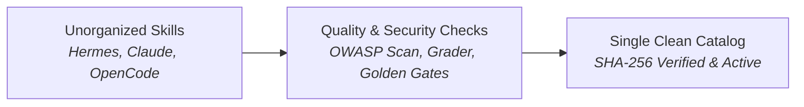

<div align="center">

# 🛡️ Skills Catalog Governance

**The automated quality gate and verified catalog for AI agent skills.**

Turn fragmented, unvetted agent skill sprawl into a single, secure, and production-ready catalog.

[](https://github.com/abhilash333naidu/skills-catalog-governance/actions/workflows/ci.yml)
[](https://www.python.org/downloads/)
[](LICENSE)
[](https://astral.sh/ruff/)
[]()
[]()

</div>

<div align="center">
  <picture>
    <source media="(prefers-color-scheme: dark)" srcset="assets/brand/hero.svg">
    
  </picture>
</div>

---

## ⏱️ Overview in 60 Seconds

AI coding agents (like Claude Code, Hermes, OpenCode, and Codex) install and generate reusable "skills" — instructions, tools, and scripts that teach the AI how to do specific jobs.

When multiple developers and agents create skills independently, catalogs quickly degrade into **untracked duplicates, broken scripts, and security vulnerabilities**. 

**Skills Catalog Governance** provides an automated, fail-closed engineering pipeline that audits, verifies, deduplicates, and security-scans agent skills before they are promoted to production.

---

## 💡 What Problem This Solves

### The Real-World Analogy

> **The Cluttered Shared Workshop:**
> Imagine a shared company workshop where 50 technicians bring their own unmarked toolboxes. Over time, you have 15 different versions of the same wrench, three are cracked, two are mislabeled, and a few have dangerous unauthorized modifications. Nobody knows which tool is safe or up to date.
>
> **Skills Catalog Governance** acts as the **Master Toolmaster & Quality Inspector**:
> 1. It gathers and inspects every tool across all boxes (**Discovery & Grouping**).
> 2. It tests and scans each tool against safety standards (**Quality & Security Checks**).
> 3. It archives broken duplicates safely and places the single best, certified version in a locked master cabinet (**Single Clean Catalog**).

### Core Challenges Solved

* **Skill Sprawl & Duplication:** Eliminates overlapping and conflicting skills across different agent profiles.
* **Security & Supply Chain Risks:** Automatically scans for dangerous patterns (arbitrary code execution, destructive commands, shell piping, credential exfiltration).
* **Behavior Drift & Silent Breakage:** Cryptographically locks verified skills with SHA-256 hashes to guarantee that approved skills cannot be silently altered without re-review.
* **Zero Overhead:** Pure Python standard library with **zero external dependencies** (`pip install` not required).

---

## 🔄 How It Works



### The 3-Step Lifecycle

1. **Intake & Discovery:** Automatically discovers and inventories all skills across developer environments.
2. **Evaluation & Security Gates:** Performs static heuristic security scans (OWASP-aligned tripwires) and structural test grading against deterministic fixtures.
3. **Decide & Activation:** Requires human approval with cryptographic evidence binding; promotes approved skills to the active catalog while safely archiving older versions (never `rm -rf`).

---

## 🌟 Key Features

* **🛡️ OWASP-Aligned Security Tripwires:** Static scanning for high-risk behaviors (`curl | sh`, `rm -rf /`, credential harvesting, prompt injection overrides).
* **🧪 Deterministic Fixture Grader:** Evaluates skill outputs and allowed-tool permissions against test fixtures without running untrusted code.
* **🔒 Fail-Closed Integrity:** Changes to quarantined skill bytes invalidate prior reviews and force mandatory re-evaluation.
* **📦 Non-Destructive Archiving:** Automatically preserves previous versions and archives retired skills with an audit journal.
* **⚡ 100% Zero-Dependency Python:** Works out of the box on Windows, macOS, and Linux using Python 3.10+ standard library.

---

## 🚀 Quick Start

### 1. Installation

```bash
# macOS / Linux
curl -fsSL https://raw.githubusercontent.com/abhilash333naidu/skills-catalog-governance/main/install.sh | bash
```

```powershell
# Windows
irm https://raw.githubusercontent.com/abhilash333naidu/skills-catalog-governance/main/install.ps1 | iex
```

### 2. Verify Package Integrity

```bash
python scripts/catalog_governance.py check-package --root .
```

---

## 🔧 Technical Details & CLI Reference

<details>
<summary><b>▶ 1. Security Scanner (`scan-security`)</b></summary>

Statically scans a skill directory for dangerous security and supply chain patterns:

```bash
# Scan a skill directory; exit 1 if any HIGH severity finding is detected
python scripts/catalog_governance.py scan-security --path ./skill-dir --fail-on high

# Supported threshold levels: none | low | medium | high
python scripts/catalog_governance.py scan-security --path ./skill-dir --fail-on medium
```

> **Security Posture Note:** Findings are explicitly labeled as **tripwires, not boundaries**. Static regex scanning catches common high-risk payloads and supply chain hazards, but cannot prove the complete absence of obfuscated runtime attacks.

</details>

<details>
<summary><b>▶ 2. Fixture-Based Grader (`grade-skill`)</b></summary>

Runs structural test suites against skill definitions to verify format compliance and tool permissions:

```bash
python scripts/catalog_governance.py grade-skill --path ./skill-dir --fixtures ./fixtures.json
```

* **Exact Output Testing:** Normalizes whitespace and newlines (CRLF→LF) and compares against fenced markdown output blocks.
* **Tool Constraints:** Verifies declared `allowed-tools` in frontmatter against expected fixture requirements.
* **Deterministic Reports:** Produces machine-readable JSON reports tagged with `skills-catalog-grade-1` schema.

</details>

<details>
<summary><b>▶ 3. Six-Phase Governance Lifecycle (M1–M6)</b></summary>

```bash
# M1 · Discover: Inventory skills across local stores
python scripts/catalog_governance.py detect-skills --output inventory.json

# M2 · Group: Identify near-duplicate overlap families
python scripts/catalog_governance.py detect-groups --inventory inventory.json --overlap-threshold 0.50

# M3.5 · Golden Gate: Verify output reproduction
python scripts/catalog_governance.py golden-gate --manifest golden.json --workdir ./work

# M4 · Master Build: Enforce naming, versioning, and format standards
python scripts/catalog_governance.py check-master --draft master.SKILL.md

# M5 · Benchmark: Compare master candidate against source skills
python scripts/catalog_governance.py benchmark --bundle docs/benchmark.json

# M6 · Promotion: Non-destructive hash-bound activation
python scripts/catalog_governance.py verify-approval --draft master.SKILL.md --approval approval.json
python scripts/catalog_governance.py preflight-moves --root ./skills --archive ./skills-archive --manifest manifest.json --plan plan.json
python scripts/catalog_governance.py apply-moves --plan plan.json --apply --yes
```

</details>

<details>
<summary><b>▶ 4. Full Command Index</b></summary>

| Subcommand | Purpose |
|---|---|
| `detect-skills` | Inventories skills with SHA-256 fingerprints |
| `detect-groups` | Finds overlap families (TF-IDF + word overlap) |
| `scan-security` | Static OWASP-aligned security audit |
| `grade-skill` | Fixture-based structural test grader |
| `golden-gate` | Verifies exact output reproduction |
| `check-master` | Validates candidate master skill quality gates |
| `benchmark` | Executes comparative evaluation benchmarks |
| `verify-approval` | Verifies cryptographically bound human sign-off |
| `preflight-moves` | Plans safe non-destructive catalog archiving |
| `apply-moves` | Executes move plans with locking & drift protection |
| `check-package` | Verifies governance engine repository integrity |

Run `python scripts/catalog_governance.py --help` for full argument details.

</details>

---

## 🛡️ Safety & Integrity Model

Skills Catalog Governance enforces deterministic safety throughout the pipeline:

| Control | Mechanism | Purpose |
|---|---|---|
| **Cryptographic Hashing** | SHA-256 fingerprints on every artifact | Detects silent tampering or drift |
| **Fail-Closed Gate** | Blocked proposals require fresh re-evaluation | Prevents bypasses when modifying blocked skills |
| **Safe Archiving** | Atomic file moves to `skills-archive/` | Guarantees zero data loss (never deletes files) |
| **Zero Execution** | Pure static analysis | Ingests untrusted third-party skills without execution |

For vulnerability disclosure and security reports, see [`SECURITY.md`](SECURITY.md).

---

## 📚 Documentation & Specifications

* **Architecture Deep-Dive:** [`docs/architecture.md`](docs/architecture.md)
* **Lifecycle Specification:** [`docs/lifecycle.md`](docs/lifecycle.md)
* **V2.2 Product Requirements (PRD):** [`docs/v2.2/PRD-V2.2.md`](docs/v2.2/PRD-V2.2.md)
* **V2.2 Formal Specification:** [`docs/v2.2/SPEC-V2.2.md`](docs/v2.2/SPEC-V2.2.md)
* **V2.2 Threat Model:** [`docs/v2.2/THREAT-MODEL-V2.2.md`](docs/v2.2/THREAT-MODEL-V2.2.md)
* **V2.2 Test Plan:** [`docs/v2.2/TEST-PLAN-V2.2.md`](docs/v2.2/TEST-PLAN-V2.2.md)

---

## 🤝 Contributing

Contributions are welcome! Please review [`CONTRIBUTING.md`](CONTRIBUTING.md) and [`CODE_OF_CONDUCT.md`](CODE_OF_CONDUCT.md).

```bash
# Run local verification suite
python -m pip install -r requirements-dev.txt
python -m pytest tests/ --cov=scripts
ruff check scripts/ tests/
python scripts/catalog_governance.py check-package --root .
```

---

## 📄 License

This project is licensed under the [MIT License](LICENSE).
